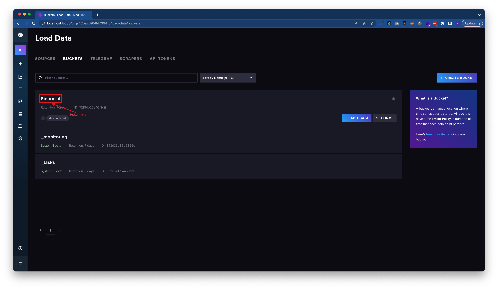
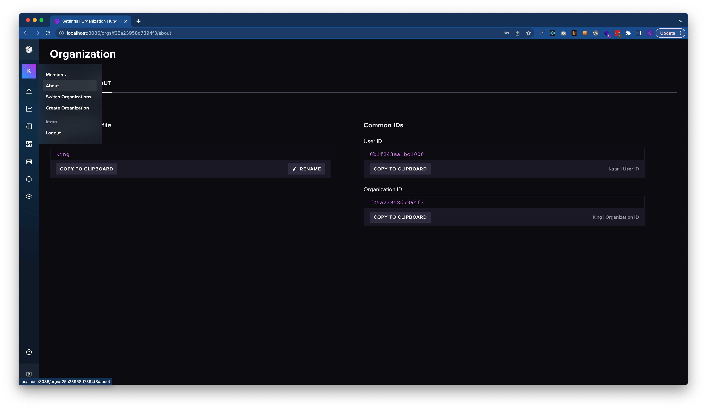
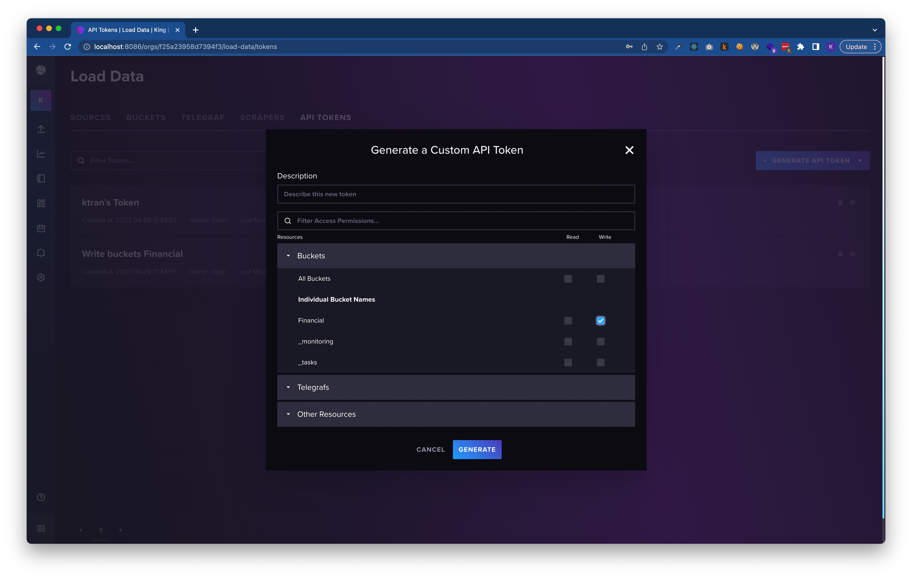
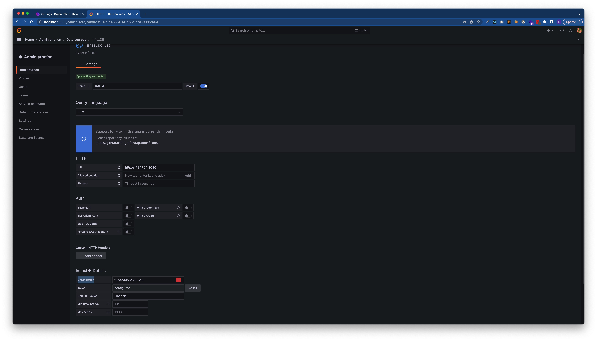
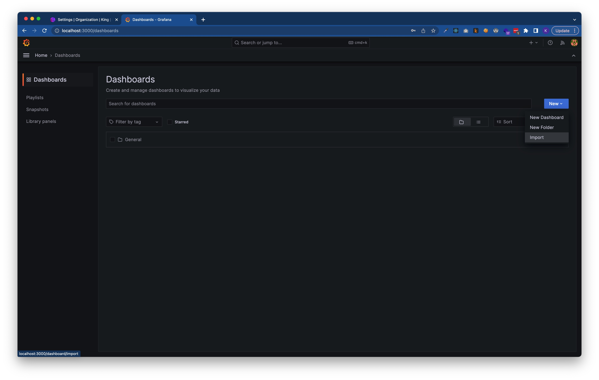

# Financial monitoring

## How to install

### Prerequire

- Docker
- Go
- Grafana
  Start grafana by docker. Run command:

```bash
docker run -d --name=grafana -p 3000:3000 grafana/grafana
```

- InfluxDB
  Start influxDB by docker. Run command:

```bash
docker run -d -p 8086:8086 \
      -v $PWD/data:/var/lib/influxdb2 \
      -v $PWD/config:/etc/influxdb2 \
      -e DOCKER_INFLUXDB_INIT_MODE=setup \
      -e DOCKER_INFLUXDB_INIT_USERNAME=admin \
      -e DOCKER_INFLUXDB_INIT_PASSWORD=admin1234 \
      -e DOCKER_INFLUXDB_INIT_ORG=my-org \
      -e DOCKER_INFLUXDB_INIT_BUCKET=financial \
      -e DOCKER_INFLUXDB_INIT_ADMIN_TOKEN=eTjVDmFXk38b-6312uMIctjZGUnCuyil_hRQaioiP7HDOyXixL4pu_TEWVd5a_hhlP4rzE72WpsLAAabxmr2hQ== \
      influxdb:2.7
```

### Import data to InfluxDB

Go to `http://localhost:8086` to config the influx db.

After configure InfluxDB, go to bucket to get bucket id  and put it to `bucket` variable in [main.go](./main.go) on line 52.

Get org id by go to about page  and put it to org variable in [main.go](./main.go) on line 51.

Create API token for write access on the bucket  and put it token variable in [main.go](./main.go) on line 47.

Write your data to file [financial_report](./financial_report.csv) follow the existing format. And run this application by command

```sh
go run .
```

### Showing data by grafana dashboard

Go to grafana dashboard `http://localhost:3000`, the default credential is admin/admin. Creating a new data source for influx db.
Put the influx DB URL to URL field (Please note that we are running on docker so it may not localhost, we can get the IP of docker bridge to connect 2 applications).
Choose Flux on Query language field and put value for Organization, token(with read access) and default bucket 
Import dashboard by click import  and choose the file in [grafana-dashboard](./grafana-dashboard/)
After that, the dashboard will be shown. Please note that currently we are hard code the bucket name in the flux query and some other data, we you may need to adjust the value for it to make it show properly
